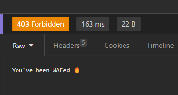

# AWS App Runner + WAF & X-Ray

AWS App Runner using WAF rules.

Create the infrastructure:

```sh
terraform init
terraform apply -auto-approve
```

The default image will be NGINX.

### WAF

Customize WAF rules behavior:

```terraform
waf_allowed_country_codes = ["BR", "US"]
```

To test the rate-limiting rule, run a loop and verify in another terminal when it starts blocking. Example:

```sh
bash loop.sh https://<app_id>.us-east-2.awsapprunner.com
```

Blocked requests should have a custom message:



### Optional (ECR)

To use ECR, configure the `.auto.tfvars` file before creating the resources:

```sh
bash ecrPushHttpbin.sh
```

Also, uncomment the ECR authentication:

```terraform
authentication_configuration {
  access_role_arn = var.access_role_arn
}
```

Create the repository:

```sh
aws ecr create-repository --repository-name dotnet-app
```

Build and publish the image:

```
docker build . -t <ACCOUNT_ID>.dkr.ecr.<REGION>.amazonaws.com/dotnet-app:latest
aws ecr get-login-password --region <REGION> | docker login --username AWS --password-stdin <ACCOUNT_ID>.dkr.ecr.<REGION>.amazonaws.com
docker push <ACCOUNT_ID>.dkr.ecr.<REGION>.amazonaws.com/dotnet-app:latest
```

### Local Testing

Running the .NET app:

```sh
dotnet restore
dotnet run
```

For local building the docker image:

```sh
docker build -t dotnet-app-image .
docker run --rm -p 80:80 --name dotnet-app dotnet-app-image
```
